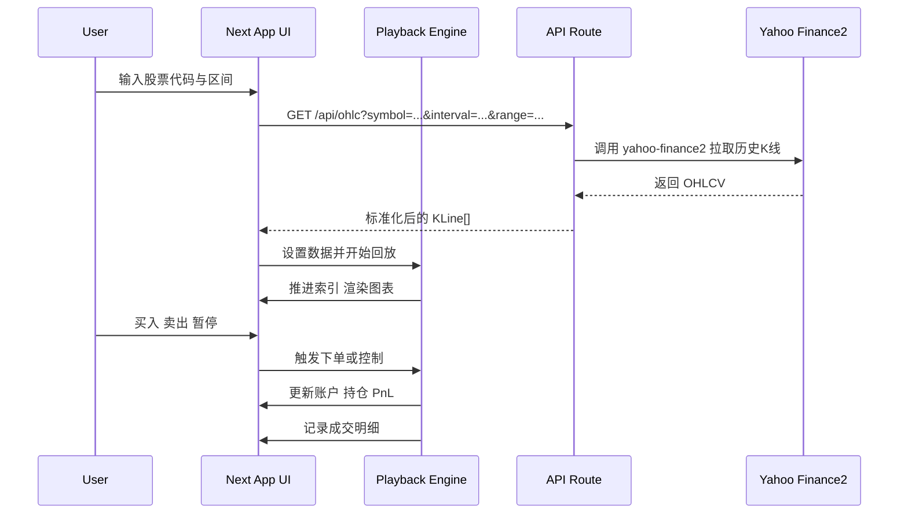

# 股票模拟操盘器 开发计划 v0.2（基于预设B）

概述
- 目标：提供基于历史K线的单标的模拟操盘训练，支持回放、快进快退、单根K线步进、买卖下单（含做空）、账户与成交明细记录。
- 数据源：使用开源 npm 包 yahoo-finance2 的 API 拉取历史数据，仅在服务端调用（Cloudflare Workers 已启用 nodejs_compat）。
- 运行环境：Next.js 15 App Router，部署至 Cloudflare Workers（通过 OpenNext Cloudflare）。

功能范围
- K线回放：播放、暂停、停止、速度调节、快进快退、单根步进、跳转到指定日期。
- 图表：显示历史K线、可选成交量、副图指标（v0.1 可暂不做指标）。
- 交易：买入、卖出、平仓，支持做空；记录成交，计算浮动与已实现盈亏。
- 账户面板：资金、持仓数量（可为负数）、持仓均价、仓位市值、权益、盈亏。
- 交易明细：时间、方向、价格、数量、手续费、滑点、已实现盈亏、持仓后状态。
- 键盘快捷键：空格播放/暂停，左右方向步进，上下方向快进快退（可作为后续项）。
- 持久化：本地存储为主，可选接入 Cloudflare D1（后续里程碑）。

技术栈与依赖
- 前端：React 19 + Next.js 15 App Router。
- 图表库：lightweight-charts（体积小、K线友好）。
- 数据：yahoo-finance2（npm 包，只在服务端调用）。
- 状态管理：React Context + Reducer（v0.1），后续可引入 Zustand。
- 类型：TypeScript 全量建模。

顶层结构与模块
- 页面：[src/app/page.tsx](src/app/page.tsx)
- 路由 API：[src/app/api/ohlc/route.ts](src/app/api/ohlc/route.ts)
- 组件：
  - 图表：[src/components/Chart.tsx](src/components/Chart.tsx)
  - 播放控制：[src/components/PlaybackControls.tsx](src/components/PlaybackControls.tsx)
  - 交易面板：[src/components/TradePanel.tsx](src/components/TradePanel.tsx)
  - 成交明细：[src/components/TradeLog.tsx](src/components/TradeLog.tsx)
- 核心逻辑：
  - 回放引擎：[src/lib/replay/engine.ts](src/lib/replay/engine.ts)
  - 交易撮合与账户：[src/lib/trade/sim.ts](src/lib/trade/sim.ts)
  - 类型定义：[src/lib/types.ts](src/lib/types.ts)
  - 数据拉取封装：[src/lib/data/yahoo.ts](src/lib/data/yahoo.ts)
  - 全局配置：[src/lib/config.ts](src/lib/config.ts)

架构与数据流

数据与类型建模（简化）
- Candle
  - time: number | string
  - open, high, low, close: number
  - volume: number
- Trade
  - id, time, side (buy/sell/short/cover), price, qty, fee, slippage, pnlRealizedAfter
- Portfolio
  - cash, positionQty (可为负), avgPrice, equity, pnlUnrealized, pnlRealized
- ReplayState
  - index, speed, status, interval, symbol

API 设计
- GET /api/ohlc
  - query: symbol, interval(1d|5m), range(1d: up to 5y; 5m: up to 30d), tz 可选
  - 响应：标准化 KLine[]（字段：time, open, high, low, close, volume）
  - 实现：服务端调用 yahoo-finance2，对时区与复权/拆分做处理
- 未来可加：/api/symbol/validate 用于校验代码

回放引擎设计
- 状态机：Idle / Playing / Paused / Completed
- 速度档位：0.5x / 1x / 2x / 4x
- 步进：
  - 单根步进：index += 1 或 -= 1
  - 快进快退：index += 10 或 -= 10（可配置）
  - 跳转日期：根据时间二分定位
- 调度：setInterval 或 requestAnimationFrame 驱动，根据速度推进索引
- 边界：
  - 播放到末尾进入 Completed
  - 退到开头保持 index >= 0
- 键盘：
  - 空格 播放/暂停，Left/Right 步进，Up/Down 快进/快退

交易撮合与账户规则 v0.2（预设B）
- 初始资金：50000
- 订单类型：市价单
- 数量：用户自定义（整数股）
- 手续费：按成交金额的 0.2%（万二），最低 1
- 滑点：5 bps（0.05%）
- 做空：允许做空（不加杠杆），持仓数量可为负；默认不计融资利息与保证金占用（后续可扩展）
- 成交价：用当前 K 线的收盘价模拟
- PnL：
  - 已实现：平仓或部分对冲后计算
  - 浮动：基于最新价与均价；空头浮盈计算方向相反
- 资金与权益：
  - 现金因买卖与费用变动
  - 权益 = 现金 + 持仓市值（空头为负的市值贡献） + 浮动盈亏（隐含在市值中）
  - 平仓时将浮盈转化为已实现盈亏

UI 布局草图
- 顶部：输入股票代码、区间、加载按钮
- 左侧主区：K线图
- 底部：播放控制条（播放、暂停、速度、步进、快进快退、进度条）
- 右侧：账户面板和买卖面板（数量、买入、卖出/做空、平仓）
- 下方：成交明细表
- 响应式：小屏将右侧面板折叠为可切换的 Tab

状态管理
- React Context 提供 ReplayState 和 Portfolio
- 分离纯函数：撮合与回放推进均为纯函数，便于单测

持久化与会话
- 浏览器 localStorage 保存最近一次会话与设置
- 可选：Cloudflare D1 存储历史训练记录（后续里程碑）

性能要点
- 只渲染可见窗口的 K 线范围
- 播放时批量推进并节流 UI 更新
- 使用 Web Worker 可作为后续优化

测试策略
- 单元测试：撮合函数（含做空）、PnL 计算、回放推进边界
- 组件测试：播放控制交互
- 集成测试：加载真实代码数据并跑一段回放

安全与稳定
- API 对入参做校验与节流
- 对 Yahoo API 错误做重试与降级
- 对时区与缺失数据做补齐或过滤

分步实施清单
1. 初始化依赖与项目设置
   - 安装：npm i yahoo-finance2 lightweight-charts
2. 定义类型与纯函数
   - [src/lib/types.ts](src/lib/types.ts)
   - [src/lib/trade/sim.ts](src/lib/trade/sim.ts) 撮合与 PnL（含做空）
   - [src/lib/replay/engine.ts](src/lib/replay/engine.ts) 回放推进
3. 数据 API
   - [src/lib/data/yahoo.ts](src/lib/data/yahoo.ts) 服务端封装
   - [src/app/api/ohlc/route.ts](src/app/api/ohlc/route.ts) 组装响应
4. UI 组件
   - 图表组件集成 lightweight-charts
   - 播放控制 / 交易面板 / 成交表
5. 页面装配与状态
   - Context 提供与消费
   - 键盘快捷键
6. 持久化
   - localStorage 水线
7. 测试与打磨
   - 关键路径单测（含做空）
   - 手动验证
8. 部署
   - Cloudflare 预览与生产发布

已确认预设（v0.2）
- interval：1d、5m
- range：1d 最长 5y；5m 最长 30d
- 初始资金：50000
- 下单数量：用户自定义（整数股）
- 手续费：0.2% 最低 1
- 滑点：5 bps
- 交易：允许做空，不使用杠杆（持仓可为负，默认不计融资利息）
- 时区：按交易所时区（例如美股 America/New_York）
- 复权：优先使用复权后的 close；OHLC 不可得时以 adjClose 替代 close
- 市场：先支持美股单标的（AAPL、MSFT 等）
- 图表库：lightweight-charts

里程碑验收标准
- M1 可加载代码并显示 K 线，可播放/暂停与步进
- M2 可买卖与平仓，账户与成交明细正确（含做空流程）
- M3 快进快退、跳转日期、快捷键齐全
- M4 持久化与基础测试通过

兼容性说明（Cloudflare Workers）
- 项目通过 [wrangler.jsonc](wrangler.jsonc) 启用了 nodejs_compat，yahoo-finance2 在服务端仅导入与执行。
- 严禁在客户端导入 yahoo-finance2，所有数据请求走服务端 API。
- 如遇到个别 Node 模块不兼容，可临时回退为 fetch Yahoo Chart JSON 接口的直连实现（保持相同输出结构）。

参考文件树
- [src/app/page.tsx](src/app/page.tsx)
- [src/app/api/ohlc/route.ts](src/app/api/ohlc/route.ts)
- [src/components/Chart.tsx](src/components/Chart.tsx)
- [src/components/PlaybackControls.tsx](src/components/PlaybackControls.tsx)
- [src/components/TradePanel.tsx](src/components/TradePanel.tsx)
- [src/components/TradeLog.tsx](src/components/TradeLog.tsx)
- [src/lib/types.ts](src/lib/types.ts)
- [src/lib/trade/sim.ts](src/lib/trade/sim.ts)
- [src/lib/replay/engine.ts](src/lib/replay/engine.ts)
- [src/lib/data/yahoo.ts](src/lib/data/yahoo.ts)
- [src/lib/config.ts](src/lib/config.ts)